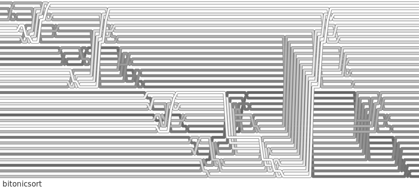

# bitonicsort

## code
```python
import math
ASCENDING = True
DESCENDING = False

def compare(lst, i, j, dir):
    if dir == (lst[i] > lst[j]):
        lst[i], lst[j] = lst[j], lst[i]
        lst.log()


def merge(lst, lo, n, dir):
    if n > 1: 
        k = n//2
        for i in range(lo, lo+k):
            compare(lst, i, i+k, dir)
        merge(lst, lo, k, dir)
        merge(lst, lo+k, k, dir)


def _bitonicsort(lst, lo, n, dir):
    if n > 1:
        k = n//2
        _bitonicsort(lst, lo, k, ASCENDING)
        _bitonicsort(lst, lo+k, k, DESCENDING)
        merge(lst, lo, n, dir)


def bitonicsort(lst):
    # Length of list must be 2**x, where x is an integer.
    assert math.modf(math.log(len(lst), 2))[0] == 0
    _bitonicsort(lst, 0, len(lst), ASCENDING)
```

List order is sampled for visualisation whenever `lst.log()` is called.