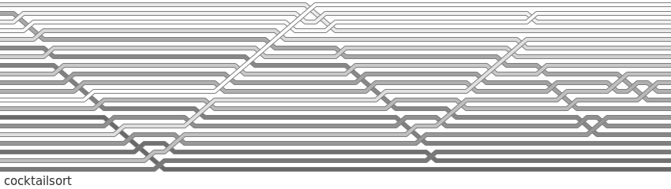

# cocktailsort

## code
```python
def cocktailsort(lst):
    begin, end = 0, len(lst) - 1
    finished = False
    while not finished:
        finished = True
        for i in range(begin, end):
            if lst[i] > lst[i + 1]:
                lst[i], lst[i + 1] = lst[i + 1], lst[i]
                lst.log()
                finished = False
        if finished:
            break
        finished = True
        end -= 1
        for i in reversed(range(begin, end)):
            if lst[i] > lst[i + 1]:
                lst[i], lst[i + 1] = lst[i + 1], lst[i]
                lst.log()
                finished = False
        begin += 1
```

List order is sampled for visualisation whenever `lst.log()` is called.