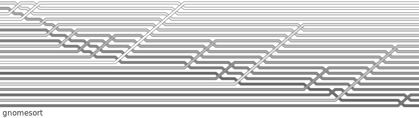

# gnomesort

## code
```python
def gnomesort(lst):
    i = 0
    while i < len(lst):
        if i == 0 or lst[i] >= lst[i - 1]:
            i += 1
        else:
            lst[i], lst[i - 1] = lst[i - 1], lst[i]
            lst.log()
            i -= 1
```

List order is sampled for visualisation whenever `lst.log()` is called.