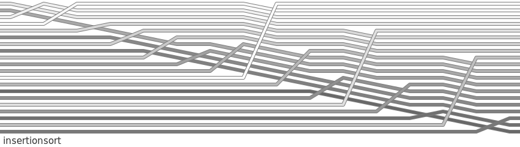

# insertionsort

## code
```python
def insertionsort(lst):
    for i in range(1, len(lst)):
        for j in range(i):
            if lst[i] < lst[j]:
                x = lst.pop(i)
                lst.insert(j, x)
                lst.log()
```

List order is sampled for visualisation whenever `lst.log()` is called.