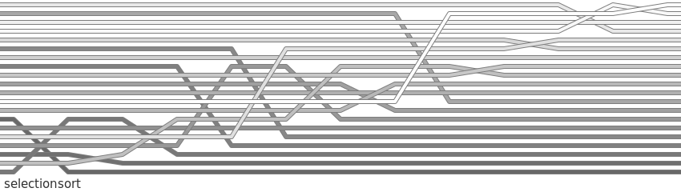

# selectionsort

## code
```python
def selectionsort(lst):
    for j in range(len(lst)-1, -1, -1):
        m = lst.index(max(lst[:j+1]))  # No, this is not efficient ;)
        lst[m], lst[j] = lst[j], lst[m]
        if m != j:
            lst.log()
```

List order is sampled for visualisation whenever `lst.log()` is called.