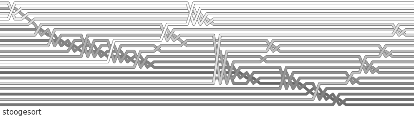

# stoogesort

## code
```python
def stoogesort(lst, i=0, j=None):
    if j is None:
        j = len(lst) - 1
    if lst[j] < lst[i]:
        lst[i], lst[j] = lst[j], lst[i]
        lst.log()
    if j - i > 1:
        t = (j - i + 1) // 3
        stoogesort(lst, i, j - t)
        stoogesort(lst, i + t, j)
        stoogesort(lst, i, j - t)
```

List order is sampled for visualisation whenever `lst.log()` is called.